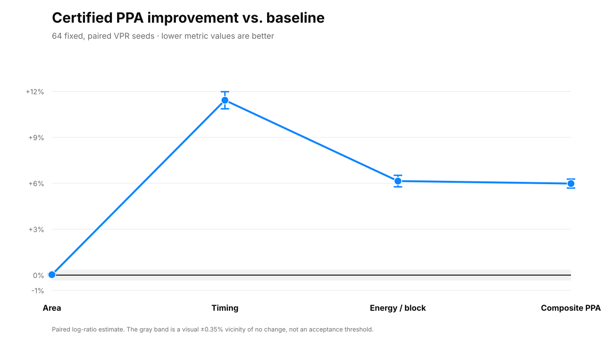
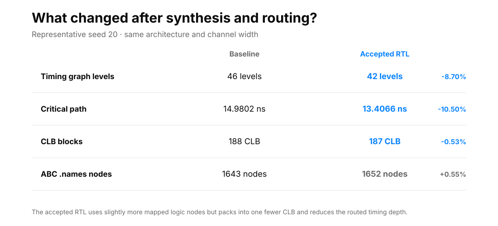
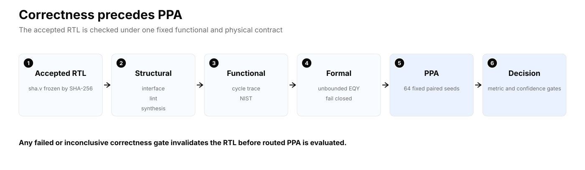
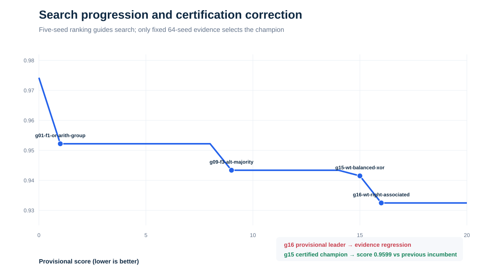

# Formally verified RTL optimization: a SHA-1/VTR case study

[](https://github.com/juan-fernandez-gotherlabs/rtl-optimization-case-study/actions/workflows/verify.yml)

**Four cycle-equivalent RTL rewrites improved estimated post-route composite PPA by 5.98% across 64 paired implementation seeds.** The interface, protocol, latency, state-visible behavior and tool flow remained fixed.



This repository is an independent, auditable engineering case study prepared by Juan José Fernández. It demonstrates a verification-first method for RTL optimization; it does **not** claim an ASIC, commercial-FPGA, manufactured-silicon or signoff result.

## Certified result

| Metric | Baseline median | Champion median | Paired estimate | Paired 95% CI |
|---|---:|---:|---:|---:|
| Total area | 16,614,693 MWTA | 16,614,693 MWTA | **0.03% better** | -0.04% to +0.09% (neutral) |
| Critical path | 15.0054 ns | 13.28085 ns | **11.43% better** | 10.87% to 11.98% |
| Energy / block | 12.3896 nJ | 11.6399 nJ | **6.14% better** | 5.77% to 6.52% |
| Composite PPA | 1.000000 | 0.940188 | **5.98% better** | 5.69% to 6.27% |

The champion wins timing, energy and composite score in all 64 paired seeds. Area is statistically neutral: 14 wins, 41 ties and 9 losses. Active total power rises from 9.9125 mW to 10.4900 mW at the medians, while energy per completed block falls because the routed implementation completes the fixed workload faster.

## The change

Only four assignments differ between the [corrected baseline](rtl/baseline/sha.v) and the [certified champion](rtl/champion/sha.v): two equivalent SHA-1 Boolean forms, one balanced XOR tree and one reassociated modulo-2^32 addition. See the [reviewable patch](rtl/baseline-to-champion.patch) and the [line-by-line engineering explanation](report/technical-report.md#6-the-four-rtl-rewrites).



For representative seed 20, the champion reduces the VPR timing graph from 46 to 42 levels and packs into 187 rather than 188 CLBs. It contains slightly more ABC `.names` nodes, so the result is a topology and packing improvement rather than a simple gate-count reduction.

## Why the result is credible

Every submission is frozen by SHA-256 and must pass correctness before PPA:



- Exact interface and cycle behavior are frozen.
- NIST SHAVS Short and Long Message tests cover 129 cases; domain qualification also includes 100,000 Monte Carlo hashes.
- Pinned EQY proves conservative, structure-aware sequential equivalence. A timeout or inconclusive result fails closed.
- The verification stack was qualified with 500 deterministic MCY mutations: 454 simulation-detected, 28 formal-only rejected, 18 proven equivalent and zero inconclusive.
- Search uses five exposed seeds for ranking only. Certification uses a fixed, disjoint pool of 64 seeds and a predeclared stopping rule.
- The public score is recomputed from raw paired records; raw metrics and confidence intervals are never hidden behind the scalar.

The provisional five-seed leader was rejected during certification because its area regression became statistically visible. That failure mode is preserved as evidence that search ranking cannot silently promote a candidate.



## Audit in one command

The default check is offline, fast and requires only Python 3:

```bash
make verify
```

It verifies RTL identities, recomputes all paired log-ratio estimates and confidence intervals from the 64 raw seed records, checks the formal and NIST evidence references, and re-applies the published decision rule.

Regenerate the figures from the certified JSON:

```bash
make figures
```

Build the PDF report with the documented report dependency:

```bash
make report
```

Full routed measurement is intentionally separate from this quick audit. See [Reproducibility](REPRODUCIBILITY.md) for the pinned Linux/amd64 image, resource limits and candidate commands.

## Read next

- [Executive summary](EXECUTIVE_SUMMARY.md)
- [Resumen ejecutivo en español](RESUMEN_EJECUTIVO_ES.md)
- [Technical report](report/technical-report.md)
- [PDF report](report/technical-report.pdf)
- [Two-page executive PDF](report/executive-summary.pdf)
- [Full path-sanitized evidence archive](https://github.com/juan-fernandez-gotherlabs/rtl-optimization-case-study/releases/download/v1.0.0/g15-wt-balanced-xor-public-evidence.tar.gz)
- [Limitations and claims boundary](LIMITATIONS.md)
- [Evidence index](evidence/README.md)
- [Third-party provenance](THIRD_PARTY_NOTICES.md)

## Repository map

```text
rtl/          corrected baseline, champion and exact patch
contract/     frozen interface, testbenches, EQY config and domain manifest
results/      compact baseline, champion, search and 64-seed records
evidence/     formal and archive identities plus release checksums
figures/      generated SVG figures
report/       technical report in Markdown and PDF
scripts/      evidence verifier, figure generator and report builder
reproduce/    exact evaluator snapshot and pinned Docker environment
```

## Scope

The target is VTR's open academic homogeneous FPGA architecture `k6_N10_I40_Fi6_L4_frac0_ff1_45nm.xml`, using its PTM45 technology model at 0.9 V and 85 °C. These are comparative research estimates, not a prediction for any commercial device. SHA-1 is used only as a legacy compute benchmark and is not recommended for new security designs.

## Author and license

Prepared by **Juan José Fernández** as an independent technical case study. Original documentation and tooling in this repository are available under the MIT License. The benchmark RTL, NIST vectors and external tools retain their own notices and licenses; see [Third-party provenance](THIRD_PARTY_NOTICES.md).
