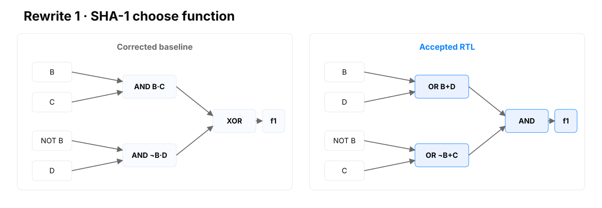
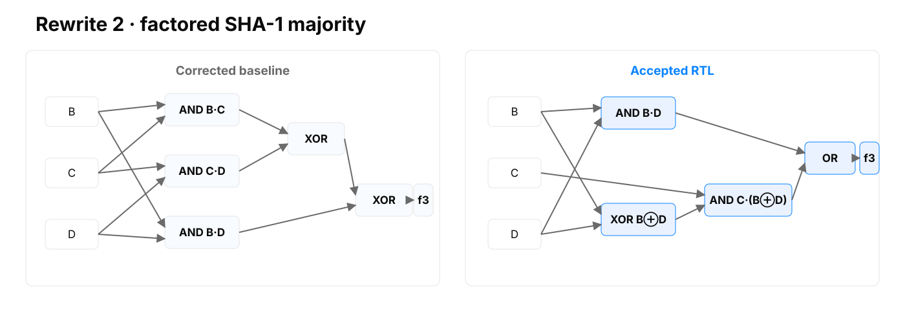
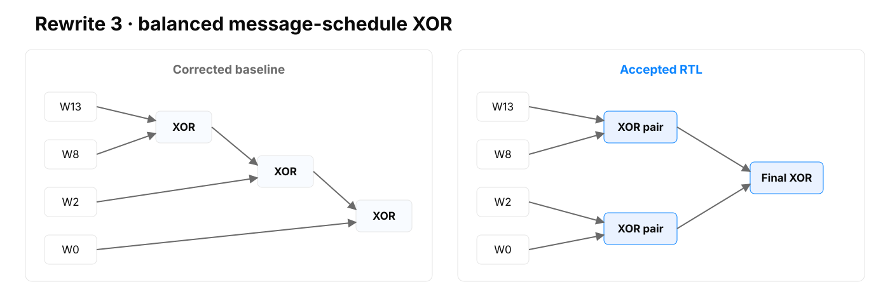
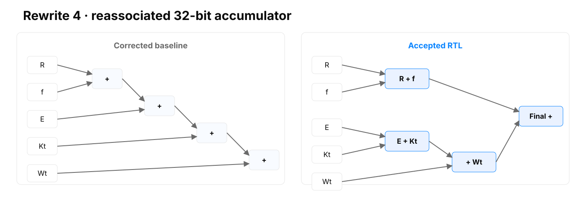

# SHA-1 RTL optimization on VTR

## Evaluated technical improvement by Göther Labs

**Evidence snapshot:** 5 August 2026
**Accepted RTL SHA-256:** `743e6c9ffcca6f00d35d5e73ba6f6478a9133a0c55a471c16d6e59d831aeeabc`

> Four cycle-equivalent RTL rewrites reduce the estimated post-route composite PPA score by **5.98%** across 64 fixed, paired VPR seeds. Critical-path delay improves by **11.43%**, workload energy by **6.14%**, and total estimated area remains statistically neutral.

This result is bounded to the declared open VTR 45 nm FPGA proxy. It is not an ASIC, commercial-FPGA, silicon or signoff claim.

## 1. Executive result

The accepted revision changes four continuous assignments in a sequential SHA-1 datapath. It does not alter the module interface, reset, command protocol, state progression, latency, throughput or register count.

| Metric | Baseline median | Accepted RTL median | Paired improvement (95% CI) |
|---|---:|---:|---:|
| Total area | 16,614,693 MWTA | 16,614,693 MWTA | +0.03% (-0.04%, +0.09%) · neutral |
| Critical path | 15.0054 ns | 13.28085 ns | **+11.43%** (+10.87%, +11.98%) |
| Energy / block | 12.3896 nJ | 11.6399 nJ | **+6.14%** (+5.77%, +6.52%) |
| Composite PPA | 1.000000 | 0.940188 | **+5.98%** (+5.69%, +6.27%) |


Timing, energy and composite score improve in all 64 paired implementations. Area produces 14 wins, 41 exact ties and 9 losses and is therefore reported as neutral. The result belongs to the combined four-line revision; no exact per-line PPA attribution is claimed.

## 2. What the module does

The evaluated module is a sequential implementation of SHA-1 compression. It accepts a 512-bit message block through a 32-bit command/data interface and updates a 160-bit chaining state through 80 rounds of Boolean mixing, rotations, a message schedule and modulo-2^32 addition. A legal block occupies 80 busy cycles.

```verilog
module sha1(clk_i, rst_i, text_i, text_o, cmd_i, cmd_w_i, cmd_o);
  input clk_i, rst_i, cmd_w_i;
  input [31:0] text_i;
  output [31:0] text_o;
  input [3:0] cmd_i;
  output [3:0] cmd_o;
endmodule
```

Only `sha.v` may change. Reset behavior, command protocol, digest read order, latency, throughput and every observable cycle remain fixed.

SHA-1 is used as a legacy compute benchmark, not as a recommended security primitive. Its combination of sequential control, word-level arithmetic and nonlinear Boolean logic provides a comprehensible public vehicle for evaluating the method.

## 3. Baseline provenance

The starting artifact is the public [VTR SHA benchmark](https://github.com/verilog-to-routing/vtr-verilog-to-routing/blob/95f5c6de9e158371ba7185bf97c07a84153735d6/vtr_flow/benchmarks/verilog/sha.v) at pinned [commit `95f5c6de9e158371ba7185bf97c07a84153735d6`](https://github.com/verilog-to-routing/vtr-verilog-to-routing/commit/95f5c6de9e158371ba7185bf97c07a84153735d6). The complete [VTR repository](https://github.com/verilog-to-routing/vtr-verilog-to-routing) is linked for independent inspection. The upstream RTL does not produce the standard digest for `abc`. A separate conformance correction creates the frozen golden source:

```text
SHA1("abc") = a9993e364706816aba3e25717850c26c9cd0d89d
```

That correction is historical preparation and is excluded from the optimization result. Every ratio in this report compares the accepted RTL with the corrected, frozen baseline.

| Artifact | SHA-256 |
|---|---|
| Corrected baseline `sha.v` | `191a4f2148a4efda7aadd24480eb13d78a1d2c0c7e8a3fcc37c44f6a8e8011e5` |
| Accepted `sha.v` | `743e6c9ffcca6f00d35d5e73ba6f6478a9133a0c55a471c16d6e59d831aeeabc` |

## 4. Evaluation contract

A PPA comparison is meaningful only when baseline and accepted RTL share the same functional, physical and statistical contract.

| Contract dimension | Frozen choice |
|---|---|
| Editable artifact | `sha.v` only; source frozen by SHA-256 |
| Functional behavior | Exact interface, reset, protocol, latency, output order and cycle behavior |
| Conformance | NIST SHA-1 Short and Long Message corpus; 129 cases |
| Formal | EQY commit `6734d8c2...`; fail closed; 2 CPU, 7 GB, 10 min |
| Physical flow | VTR/VPR commit `95f5c6de...` under pinned Linux/amd64 image |
| Architecture | `k6_N10_I40_Fi6_L4_frac0_ff1_45nm.xml` |
| Power | VTR PTM45, 0.9 V, 85 °C; fixed active and idle traces |
| PPA sample | 64 fixed, paired VPR seeds |
| Primary metrics | Total MWTA, critical-path delay and energy per completed block |

The RTL cannot alter testbenches, activity, architecture, tool flags, seeds or parsers. Acceptance is owned by the evaluator and not by the mechanism that proposed the source change.

## 5. Verification before PPA


The accepted revision passes:

1. Interface, source-policy, lint and synthesis checks.
2. Reset, protocol, latency and cycle-trace regression.
3. NIST SHAVS Short and Long Message conformance.
4. Conservative sequential EQY equivalence after reset.
5. Route, timing, power and evidence-integrity checks for all 64 seeds.

EQY compares public outputs and stable internal cut points. Failure, timeout or inconclusive status invalidates the RTL. The proof strategy is intentionally conservative: it can reject a legal but structurally distant redesign, but a reported pass remains a proof under the declared model.

The verification stack was qualified with 500 deterministic MCY mutations of the corrected baseline. This is neither a comparison across proposed candidates nor an accepted-RTL-versus-baseline PPA measurement:

| MCY result | Count |
|---|---:|
| Detected by simulation | 454 |
| Rejected only by formal | 28 |
| Proved equivalent | 18 |
| Inconclusive | 0 |

Of the 500 mutations, 18 were formally proved equivalent. All 482 functionally distinguishable mutations were rejected: 454 by simulation and 28 only by formal. Mutation qualification measures the sensitivity of the combined test and formal stack; it is not a claim that mutation testing proves absence of every possible defect.

## 6. The four RTL rewrites

The complete baseline-to-accepted patch comes from `sha.v`. The line numbers are identical in the corrected baseline and accepted RTL:

```diff
sha.v:129  - assign SHA1_f1_BCD = (B & C) ^ (~B & D);
sha.v:129  + assign SHA1_f1_BCD = (B | D) & ((~B) | C);

sha.v:131  - assign SHA1_f3_BCD = (B & C) ^ (C & D) ^ (B & D);
sha.v:131  + assign SHA1_f3_BCD = (B & D) | (C & (B ^ D));

sha.v:141  - assign SHA1_Wt_1 = W13 ^ W8 ^ W2 ^ W0;
sha.v:141  + assign SHA1_Wt_1 = (W13 ^ W8) ^ (W2 ^ W0);

sha.v:144  - assign next_A = {A[26:0],A[31:27]} + SHA1_ft_BCD + E + Kt + Wt;
sha.v:144  + assign next_A = ({A[26:0],A[31:27]} + SHA1_ft_BCD) + (E + Kt + Wt);
```

### 6.1 Choose function

Source: `sha.v:129` in both frozen revisions.



Why they are equivalent:

\[
\begin{aligned}
F &= BC \oplus (\neg B)D \\
  &= BC \lor (\neg B)D \\
  &= (B \lor D)((\neg B) \lor C)
\end{aligned}
\]

The products `BC` and `not-B·D` are mutually exclusive because `B` and `not-B` cannot both be one, so their XOR equals OR. Expanding the accepted product-of-sums gives `BC OR not-B·D OR CD`. The `CD` consensus term is redundant: when `C=D=1`, either `B=1` makes `BC` true or `B=0` makes `not-B·D` true. Both forms therefore select `C` when `B` is one and `D` otherwise. EQY proved the complete sequential circuit cycle-equivalent.

### 6.2 Majority function

Source: `sha.v:131` in both frozen revisions.



Why they are equivalent:

\[
\begin{aligned}
M &= BC \oplus CD \oplus BD \\
  &= BD \oplus C(B \oplus D) \\
  &= BD \lor C(B \oplus D)
\end{aligned}
\]

The first two lines are the same XOR polynomial after factoring `C` from `BC XOR CD`. The terms `BD` and `B XOR D` cannot both be one: if `BD=1`, then `B=D=1` and `B XOR D=0`. Their XOR can therefore be replaced by OR. If `B` equals `D`, their shared value decides the majority; if they differ, `C` decides it. EQY proved the identity over the complete circuit.

### 6.3 Balanced message-schedule XOR

Source: `sha.v:141` in both frozen revisions.



Why they are equivalent:

\[
\begin{aligned}
X &= W_{13} \oplus W_8 \oplus W_2 \oplus W_0 \\
  &= (W_{13} \oplus W_8) \oplus (W_2 \oplus W_0)
\end{aligned}
\]

Bitwise XOR is associative at every bit position, so regrouping changes no result bit and introduces no carry. The parentheses expose two parallel first-level operations before the final XOR. A synthesizer may rebalance the baseline itself, but explicit RTL grouping can influence intermediate optimization, LUT packing and routing topology. EQY proved the same observable state sequence.

### 6.4 Reassociated round accumulator

Source: `sha.v:144` in both frozen revisions. Here `R` denotes rotate-left-by-5 of `A`, and `f` denotes `SHA1_ft_BCD`.



Why they are equivalent:

\[
\begin{aligned}
S &= (R + f + E + K_t + W_t) \bmod 2^{32} \\
  &= ((R + f) + (E + K_t + W_t)) \bmod 2^{32}
\end{aligned}
\]

Every operand and the assigned result is a 32-bit unsigned vector. Addition is associative modulo `2^32`: discarding an overflow carry at an intermediate grouping cannot change the final low 32 bits. The accepted form changes the exposed dependency structure, not the numerical result. This identity depends on the declared widths and unsigned vector semantics, so EQY also confirmed the actual Verilog interpretation over the complete sequential design.

## 7. PPA environment and statistics

The target is VTR's homogeneous `k6_N10_I40_Fi6_L4_frac0_ff1_45nm` architecture: six-input LUTs clustered ten per logic block, with the architecture's routing and timing model. Power uses VTR PTM45 properties at 0.9 V and 85 °C. MWTA is a minimum-width-transistor-area abstraction, not physical square-micrometer area.

Two 5,000-cycle ACE traces are frozen and hashed. The active trace continuously executes diverse legal blocks and completes 60 blocks; the idle trace keeps the clock active after reset with an inactive interface. Both power analyses reuse the same placement and route.

```text
Energy per block = active total power × routed workload time / 60 blocks
```

Baseline and accepted RTL use the same 64 VPR seeds. Ratios are analyzed in log space because PPA comparisons are multiplicative. The per-seed composite is:

\[
r_s = \sqrt[3]{r_{A,s}\,r_{D,s}\,r_{E,s}}
\]

The published estimate is `exp(mean(log(r_s)))`. Two-sided 95% Student-t intervals use 63 degrees of freedom. The baseline is exactly 1.0 in paired-ratio space by construction; its absolute seed-to-seed variability remains available in the raw records.

Acceptance requires every correctness and integrity gate to pass, at least one primary metric to improve materially, no primary metric to show statistical evidence of regression and the composite one-sided 95% upper bound to remain below 1.0.

## 8. Certified result


| Metric | Wins / ties / losses |
|---|---:|
| Area | 14 / 41 / 9 |
| Timing | 64 / 0 / 0 |
| Energy | 64 / 0 / 0 |
| Composite | 64 / 0 / 0 |

The paired estimate is the inferential headline. A ratio of medians is similar but not identical because the median of ratios is not generally the ratio of medians.

### 8.1 Power and energy are different quantities

| Informative metric | Baseline median | Accepted RTL median | Raw median change |
|---|---:|---:|---:|
| Fmax | 66.6426 MHz | 75.2964 MHz | +12.99% |
| Active total power | 9.9125 mW | 10.4900 mW | +5.83% |
| Active dynamic power | 5.0713 mW | 5.7018 mW | +12.43% |
| Active static power | 4.8394 mW | 4.7916 mW | -0.99% |
| Idle total power | 4.4670 mW | 4.6550 mW | +4.21% |
| Energy / block | 12.3896 nJ | 11.6399 nJ | -6.05% |

The accepted RTL consumes more active power per unit time but less modeled energy per completed block because it finishes the workload sooner. A product constrained by peak power, thermal density or idle power could use a different acceptance policy.

## 9. Representative implementation evidence


For seed 20, the accepted RTL has nine more ABC `.names` nodes, packs into one fewer CLB and reduces the timing graph by four levels. This rules out the simplistic explanation that fewer generic mapped nodes caused the result. The supported interpretation is that the changed topology gives VTR a more favorable packing and routing solution.

Seed 20 is illustrative, not the statistical proof. Repeatability comes from the 64 paired implementations.

## 10. Reproducibility

The fast offline audit needs Python 3 only:

```bash
make verify
```

It checks RTL identities, formal and NIST references, exact 64-seed pairing, metric log-ratio estimates, confidence intervals and the acceptance conditions.

The full pinned rerun starts with:

```bash
./reproduce/build-image.sh
./reproduce/run-candidate.sh \
  rtl/accepted/sha.v \
  certification \
  /absolute/new/results/certification \
  accepted-rtl-reproduction
```

The Linux/amd64 container is capped at two CPUs, 7 GB RAM and 512 processes with runtime networking disabled. The certified run completed in 1,091.82 seconds on the qualified Apple Silicon laptop. Host contention affects wall time, not source hashes, seeds or parsed implementation results.

The complete generated archive is identified by SHA-256 `9983b1fef4509b9a9a592af8134be39eaa7545e5269ac7332206e86db7cce3e8` and is distributed separately from normal Git history.

## 11. Limits and customer transfer

This report does not provide:

- ASIC synthesis, place-and-route or signoff;
- commercial-FPGA implementation data;
- extracted parasitics, PVT corners, clock-tree signoff, IR drop, EM, DRC/LVS, package, yield or production-test analysis;
- proof that the same source edits improve another architecture, technology or workload;
- exact PPA attribution to an individual rewrite;
- a recommendation to use SHA-1 in a new security design.

The 64-seed confidence interval models implementation-seed variability. It does not model process, voltage, temperature, workload or tool-version uncertainty.

A customer pilot would replace the academic proxy with customer-owned RTL, formal strategy, libraries, constraints, activity, tools and signoff policy. The transferable deliverable is the combination of a small inspectable change and an evaluator that can justify acceptance to the engineers responsible for the system.

## Appendix A. Evidence identities

| Artifact | SHA-256 |
|---|---|
| Corrected baseline `sha.v` | `191a4f2148a4efda7aadd24480eb13d78a1d2c0c7e8a3fcc37c44f6a8e8011e5` |
| Accepted `sha.v` | `743e6c9ffcca6f00d35d5e73ba6f6478a9133a0c55a471c16d6e59d831aeeabc` |
| EQY PASS marker | `ba3b47c5fbb189844a827ae395e816024c967b83444a06eccb71f9e34498ab07` |
| EQY driver log | `203f2ab1a1db8aadcbdbf5be88e5478b1abcb51e213e941557889e1474b9cbce` |
| Complete certification archive | `9983b1fef4509b9a9a592af8134be39eaa7545e5269ac7332206e86db7cce3e8` |

## Appendix B. Primary references

- VTR/VPR: <https://docs.verilogtorouting.org/en/latest/vpr/>
- VTR power estimation: <https://docs.verilogtorouting.org/en/latest/vtr/power_estimation/>
- EQY: <https://github.com/YosysHQ/eqy>
- NIST secure hashing validation: <https://csrc.nist.gov/projects/cryptographic-algorithm-validation-program/secure-hashing>
