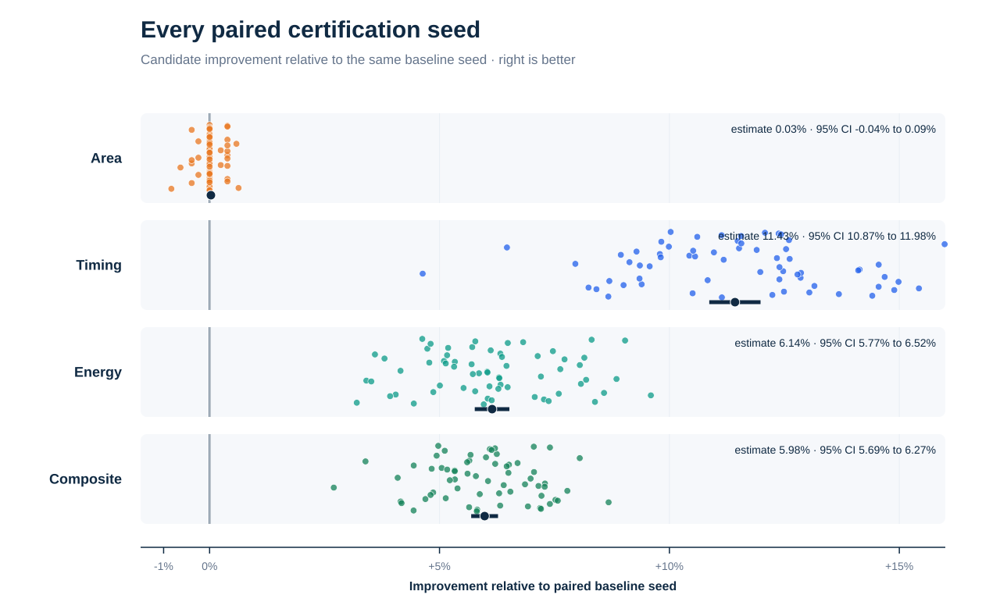

# Formally verified RTL optimization of a SHA-1 core

## Independent VTR 45 nm case study

**Prepared by Juan Jose Fernandez**

**Evidence snapshot:** 5 August 2026

**Champion:** `g15-wt-balanced-xor`
**Champion RTL SHA-256:** `743e6c9ffcca6f00d35d5e73ba6f6478a9133a0c55a471c16d6e59d831aeeabc`

> Four cycle-equivalent RTL rewrites improve the estimated post-route composite PPA score by **5.98%** across 64 paired, fixed and search-disjoint VPR seeds. Timing improves by **11.43%**, workload energy by **6.14%**, and total area remains statistically neutral. The result is formally proved and reproducible inside the declared open FPGA contract.

This is an independent engineering case study. It is not affiliated with or endorsed by a semiconductor company. It reports comparative estimates from an academic FPGA flow, not commercial-device measurements, ASIC signoff or manufactured silicon.


## 1. Executive finding

The experiment asks a narrow engineering question: **can a search process find a small, reviewable RTL rewrite that preserves every observable cycle while producing a better implementation under a frozen physical-design proxy?**

For this benchmark, the answer is yes. The certified champion changes four continuous assignments in a SHA-1 round datapath. It does not alter the module interface, reset, command protocol, state progression, latency, throughput or register count. Under the pinned VTR/VPR 45 nm FPGA model, the champion:

| Metric | Corrected baseline median | Champion median | Paired estimate | Paired 95% CI |
|---|---:|---:|---:|---:|
| Total area | 16,614,693 MWTA | 16,614,693 MWTA | 0.03% better | -0.04% to +0.09% |
| Critical path | 15.0054 ns | 13.28085 ns | **11.43% better** | **10.87% to 11.98%** |
| Energy per block | 12.3896 nJ | 11.6399 nJ | **6.14% better** | **5.77% to 6.52%** |
| Composite PPA | 1.000000 | 0.940188 | **5.98% better** | **5.69% to 6.27%** |

All 64 paired seeds favor the champion for timing, energy and composite score. Area produces 14 wins, 41 exact ties and 9 losses, so it is correctly reported as neutral rather than improved.

The result is attractive as a pilot because the edit is small enough for a hardware engineer to review, the functional obligation is explicit, the physical result survives implementation randomness, and every public headline can be recomputed from raw per-seed records.

## 2. What the module does

The evaluated RTL is a sequential hardware implementation of SHA-1 compression. SHA-1 consumes 512-bit message blocks and updates a 160-bit internal chaining state through 80 rounds of Boolean mixing, word rotations, modular additions and a message schedule. The module exposes a narrow command/data interface rather than accepting an entire block at once:

```verilog
module sha1(
  input          clk_i,
  input          rst_i,
  input  [31:0]  text_i,
  output [31:0]  text_o,
  input  [3:0]   cmd_i,
  input          cmd_w_i,
  output [3:0]   cmd_o
);
```

The frozen protocol loads message words, starts the compression operation, waits for the fixed busy interval, and reads the digest words in a defined order. A legal block occupies 80 busy cycles. Optimizations may only edit `sha.v`; the interface and all externally visible cycle behavior are immutable.

SHA-1 is no longer appropriate for new cryptographic security designs. It is used here as a legacy hardware benchmark because it combines control state, a long iterative datapath, Boolean functions and 32-bit arithmetic with authoritative known-answer vectors.

## 3. Baseline provenance and correction boundary

The starting artifact comes from the VTR benchmark suite at commit `95f5c6de9e158371ba7185bf97c07a84153735d6`. The original upstream RTL does not produce the standard SHA-1 digest for the message `abc`. That defect is preserved as provenance evidence but is not used as the optimization baseline.

A separate, documented conformance correction establishes the golden reference. The corrected reference produces:

```text
SHA1("abc") = a9993e364706816aba3e25717850c26c9cd0d89d
```

Its SHA-256 is:

```text
191a4f2148a4efda7aadd24480eb13d78a1d2c0c7e8a3fcc37c44f6a8e8011e5
```

The conformance correction is explicitly excluded from the optimization result. Every ratio in this report compares the champion with this corrected and frozen reference.

## 4. Frozen evaluation contract

An optimization result is meaningful only relative to a fixed contract. This case study freezes:

- the `sha1` interface and `sha.v` as the only editable artifact;
- reset behavior, command protocol, latency, output order and cycle-visible behavior;
- NIST SHAVS Short and Long Message vectors and their hashes;
- VTR/VPR commit `95f5c6de9e158371ba7185bf97c07a84153735d6`;
- architecture `k6_N10_I40_Fi6_L4_frac0_ff1_45nm.xml` and its SHA-256;
- VTR PTM45 properties at 0.9 V and 85 C;
- two 5,000-cycle ACE activity profiles and their hashes;
- search and certification seed pools;
- EQY and MCY versions, resource limits and fail-closed behavior;
- primary metrics, score equation and acceptance thresholds.

The complete machine-readable definition is in [`contract/sha_vtr_manifest.json`](../contract/sha_vtr_manifest.json). Candidates are frozen by SHA-256 before evaluation so that correctness, PPA and the published artifact cannot refer to different source files.

## 5. Verification-first evaluation


PPA is not measured until lower-cost correctness gates pass:

1. **Source and interface gate.** Reject multiple modules, forbidden simulation constructs, interface drift and non-synthesizable submissions.
2. **Compile and functional gate.** Run the fixed cycle-level protocol, the `abc` known-answer test and a representative regression.
3. **NIST gate.** Run 129 SHA-1 Short and Long Message conformance cases.
4. **Formal gate.** EQY proves the candidate equivalent to the corrected reference. Timeout, inconclusive or failure invalidates the candidate.
5. **PPA search gate.** Five exposed paired VPR seeds provide provisional ranking, never certification.
6. **Certification gate.** A fixed disjoint pool of 64 paired seeds decides whether a finalist is accepted.

This order prevents compute from being spent on known-incorrect designs and prevents a statistically attractive but functionally different design from becoming a shortlist leader.

### 5.1 Formal scope

The EQY proof is unbounded and cycle-exact after reset, comparing public outputs in every cycle. The configuration also uses stable internal cut points to make the proof tractable on the declared 2-CPU, 7-GB, ten-minute envelope. It therefore proves the local structure-preserving transformations in this case study, but it may conservatively reject a functionally equivalent design that recodes state, retimes registers or replaces the microarchitecture.

That conservatism creates possible false negatives in the search space. It does not weaken a successful proof.

### 5.2 Verification qualification

The functional and formal stack was challenged with 500 deterministic MCY mutations:

| Outcome | Count |
|---|---:|
| Detected by simulation | 454 |
| Rejected only by formal | 28 |
| Proved equivalent | 18 |
| Inconclusive | 0 |

All 482 functionally distinguishable mutations were rejected. The 18 surviving mutations were formally equivalent and therefore are not test escapes. This is test-suite qualification, not a claim that mutation coverage proves absence of all defects.

## 6. The four RTL rewrites

The complete baseline-to-champion patch is:

```diff
-assign SHA1_f1_BCD = (B & C) ^ (~B & D);
+assign SHA1_f1_BCD = (B | D) & ((~B) | C);

-assign SHA1_f3_BCD = (B & C) ^ (C & D) ^ (B & D);
+assign SHA1_f3_BCD = (B & D) | (C & (B ^ D));

-assign SHA1_Wt_1 = W13 ^ W8 ^ W2 ^ W0;
+assign SHA1_Wt_1 = (W13 ^ W8) ^ (W2 ^ W0);

-assign next_A = {A[26:0],A[31:27]} + SHA1_ft_BCD + E + Kt + Wt;
+assign next_A = ({A[26:0],A[31:27]} + SHA1_ft_BCD) + (E + Kt + Wt);
```

No register, state transition, port or protocol statement changed.

### 6.1 Round function f1: choose in product-of-sums form

The baseline implements the SHA-1 choose function as:

\[
f_1(B,C,D)=(B\land C)\oplus(\lnot B\land D)
\]

The two terms are mutually exclusive: `B` and `not B` cannot both be one. XOR is therefore equivalent to OR, and Boolean algebra yields:

\[
(B\land C)\lor(\lnot B\land D)=(B\lor D)\land(\lnot B\lor C)
\]

The new expression exposes a product-of-sums topology to synthesis. Which form maps better is target-dependent; the circuit-level EQY proof, rather than the algebra alone, is the acceptance authority.

### 6.2 Round function f3: factored majority

The baseline majority expression is:

\[
f_3(B,C,D)=BC\oplus CD\oplus BD
\]

The champion uses:

\[
f_3(B,C,D)=BD\lor C(B\oplus D)
\]

If `B` equals `D`, `BD` provides the majority value and `B xor D` is zero. If they differ, the majority is exactly `C`. This form therefore implements the same three-input majority truth table with a different factorization.

### 6.3 Message schedule: explicitly balanced XOR

Bitwise XOR is associative, so:

\[
W_{13}\oplus W_8\oplus W_2\oplus W_0
=
(W_{13}\oplus W_8)\oplus(W_2\oplus W_0)
\]

The parentheses make two parallel first-level operations explicit. Synthesis is free to rebalance the baseline, but source topology can influence intermediate optimization and LUT mapping.

### 6.4 Round accumulator: reassociated modulo addition

Each signal is 32 bits and assignment truncates the result modulo \(2^{32}\). Modular addition is associative:

\[
((((R+A_f)+E)+K)+W)\bmod 2^{32}
=
((R+A_f)+(E+K+W))\bmod 2^{32}
\]

The champion exposes two partial sums before the final combination. This can shorten an inferred dependency chain even though the mathematical sum and word width are unchanged.

### 6.5 What can and cannot be attributed

The certified result belongs to the **combined four-line candidate**. No four-way ablation experiment was certified across 64 seeds, so this report does not assign an exact timing or energy contribution to any individual line. The Boolean identities explain correctness; post-synthesis and post-route evidence explains the cumulative implementation effect.

EQY proves that the combined source is cycle-equivalent to the corrected baseline over the full sequential circuit.

## 7. Search campaign and selection

The 20-generation search evaluated 46 submissions. Forty-one reached formal pass, one failed formal, and four were rejected before formal because an earlier correctness gate failed. After deduplication, 29 unique formal-pass candidates entered PPA consideration.


Five exposed seeds kept iterative evaluation affordable. They were deliberately non-certifying. The strongest provisional generation-16 candidate achieved a lower five-seed search score than generation 15, but the 64-seed pool exposed an area regression and vetoed it. Generation 15 was the only finalist that satisfied the complete acceptance rule.

This is a useful negative result: a small search sample was sufficient for ranking hypotheses but not for making the final engineering claim.

## 8. PPA environment

### 8.1 Technology and architecture

The measurement target is VTR's open homogeneous FPGA architecture `k6_N10_I40_Fi6_L4_frac0_ff1_45nm.xml`: six-input LUTs grouped in clusters of ten, with the architecture's routing and timing model. Power uses VTR's PTM45 technology properties at 0.9 V and 85 C.

This makes the experiment open and reproducible, but not directly portable to an ASIC or commercial FPGA. MWTA is VTR's minimum-width-transistor-area abstraction, not square micrometers.

### 8.2 Activity and energy

ACE consumes frozen 5,000-cycle activity traces aligned to the synthesized BLIF ports. The active trace continuously processes legal blocks and completes 60 blocks. The idle trace releases reset, keeps the clock active and leaves the interface inactive.

Workload energy is computed as:

\[
E_{block}=\frac{P_{active,total}\;T_{workload}}{N_{blocks}}
\]

where workload time uses the routed critical-path period for that seed and design. The same placement and route are reused for active and idle power analysis.

## 9. Metrics, statistics and acceptance

The three minimizable primary metrics are total area \(A\), critical-path delay \(D\), and energy per block \(E\). For each paired seed, the composite ratio is:

\[
r_s=(r_{A,s}r_{D,s}r_{E,s})^{1/3}
\]

The public estimate is calculated in log space:

\[
\hat r=\exp\left(\frac{1}{n}\sum_{s=1}^{n}\log r_s\right)
\]

Student-t bounds with 63 degrees of freedom form the two-sided 95% confidence intervals. Pairing candidate and baseline by identical VPR seed removes much of the between-seed placement/routing variation.

The declared acceptance rule requires:

- functional, NIST, synthesis, formal, route and power success;
- at least one material primary-metric improvement;
- no statistically supported regression in any primary metric;
- an upper one-sided 95% bound below 1.0 for the composite score;
- no forbidden worst-case regression under the fixed policy.

The 64-seed sample size and stopping point were fixed before finalist inspection. It was not extended after seeing a borderline outcome.

## 10. Certified result



| Quantity | Baseline | Champion | Interpretation |
|---|---:|---:|---|
| CLB blocks | 188 | 187 | One fewer in the representative seed; medians are implementation summaries |
| Registers | 892 | 892 | No architectural state reduction |
| Channel width | 46 | 46 | Same routed channel width |
| Critical-path median | 15.0054 ns | 13.28085 ns | 11.49% raw median reduction |
| Fmax median | 66.6426 MHz | 75.2964 MHz | 12.99% raw median increase |
| Active total power median | 9.9125 mW | 10.4900 mW | 5.83% increase |
| Active static power median | 4.8394 mW | 4.7916 mW | 0.99% decrease |
| Active dynamic power median | 5.0713 mW | 5.7018 mW | 12.43% increase |
| Energy median | 12.3896 nJ/block | 11.6399 nJ/block | 6.05% raw median reduction |

The paired estimates, not the ratio of medians, are the inferential result. Those estimates are 11.43% timing improvement, 6.14% energy improvement and 5.98% composite improvement.

### 10.1 Power is not energy

The champion is faster but switches more power per unit time in the active profile. Its active total-power median increases by 5.83%. Because each workload finishes in less modeled time, energy per completed block decreases by 6.14% in the paired estimate.

This is beneficial for an energy-per-operation objective. It could be unacceptable for a strict instantaneous power cap. A customer pilot must declare whether power, energy, thermal density or throughput is the controlling objective rather than treating them as interchangeable.

## 11. Representative implementation evidence


For paired seed 20, with the same architecture and channel width:

- the VPR timing graph falls from 46 to 42 levels;
- critical-path delay falls from 14.9802 ns to 13.4066 ns;
- packing uses 187 instead of 188 CLBs;
- ABC `.names` nodes rise from 1,643 to 1,652.

The increase in mapped nodes is important: the champion is not merely a smaller Boolean network according to every count. It is a topology that VTR packs and routes more effectively. The seed-20 evidence is illustrative; the 64-seed paired statistics establish repeatability.

## 12. Reproducibility and audit trail

The repository supports two levels of reproduction.

### 12.1 Fast offline audit

```bash
make verify
```

This command recomputes RTL hashes, checks the 64 paired records, rebuilds the log-ratio estimates and confidence intervals, and re-applies the acceptance decision without Docker or EDA tools.

### 12.2 Full pinned rerun

The `reproduce/` snapshot contains the exact evaluator, test assets, Dockerfile and lock file. A clean Linux/amd64 image checks out pinned tool revisions. Runtime evaluation is limited to two CPUs, 7 GB RAM, 512 processes and no network.

The champion certification completed in 1,091.82 seconds on the qualified Apple Silicon laptop. Wall time is host-dependent; parsed implementation results are tied to the frozen tool image and seed contract.

The 70 MB complete evidence is distributed as a path-sanitized release asset rather than committed to Git. Its embedded `PUBLIC_SANITIZATION.json` maps every redacted command record from its original hash to its public hash. The certified original archive identity remains recorded in [`REPRODUCIBILITY.md`](../REPRODUCIBILITY.md) and the evidence manifest.

## 13. Limitations

This case study does not provide:

- ASIC synthesis, place-and-route or signoff;
- a commercial FPGA implementation;
- extracted parasitics, multi-corner analysis, IR drop, electromigration, DRC/LVS or silicon measurement;
- proof that the same source edits help another technology, architecture or workload;
- a production-ready SHA-1 recommendation;
- exact attribution of benefit to each of the four lines.

The formal strategy is intentionally structure-aware, and the statistics model implementation-seed variation only. See [`LIMITATIONS.md`](../LIMITATIONS.md) for the complete claims boundary.

## 14. What transfers to a customer pilot

The reusable outcome is not the SHA-1 rewrite itself. It is the controlled optimization method:

1. freeze the customer's functional and implementation contract;
2. retain a clean golden source and hash every submission;
3. run correctness and formal equivalence before expensive PPA;
4. use a small paired seed pool for search;
5. certify only a fixed shortlist with a larger disjoint pool;
6. publish raw metrics, uncertainty, trade-offs and negative finalists;
7. reproduce the winner from a clean environment before delivery.

For proprietary RTL, the same structure can wrap customer-owned simulators, formal tools, libraries, constraints, power activity and signoff reports. The customer, not this academic proxy, must define the acceptance boundary.

## 15. Conclusion

A four-line, cycle-equivalent RTL change produced a repeatable 5.98% improvement in equal-weight composite area-delay-energy score under the declared VTR 45 nm contract. The area estimate remained neutral; timing and energy improved in every paired seed. Formal equivalence, NIST vectors, mutation qualification and clean evidence recomputation make the claim reviewable rather than anecdotal.

The result demonstrates a disciplined service pattern: optimization proposals remain unconstrained, but acceptance is controlled by a frozen, fail-closed, statistically explicit evaluator.

## Appendix A. Evidence identities

| Artifact | SHA-256 |
|---|---|
| Corrected baseline `sha.v` | `191a4f2148a4efda7aadd24480eb13d78a1d2c0c7e8a3fcc37c44f6a8e8011e5` |
| Champion `sha.v` | `743e6c9ffcca6f00d35d5e73ba6f6478a9133a0c55a471c16d6e59d831aeeabc` |
| EQY PASS marker | `ba3b47c5fbb189844a827ae395e816024c967b83444a06eccb71f9e34498ab07` |
| EQY driver log | `203f2ab1a1db8aadcbdbf5be88e5478b1abcb51e213e941557889e1474b9cbce` |
| Full champion archive | `9983b1fef4509b9a9a592af8134be39eaa7545e5269ac7332206e86db7cce3e8` |

## Appendix B. Primary references

- VTR/VPR documentation: <https://docs.verilogtorouting.org/en/latest/vpr/>
- VTR power estimation: <https://docs.verilogtorouting.org/en/latest/vtr/power_estimation/>
- EQY sequential equivalence checking: <https://github.com/YosysHQ/eqy>
- NIST Secure Hashing validation: <https://csrc.nist.gov/projects/cryptographic-algorithm-validation-program/secure-hashing>
